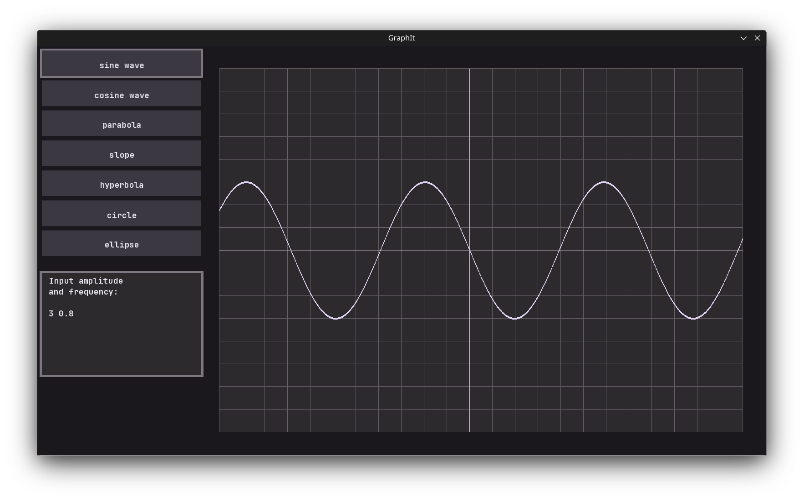

# GraphIt

> A graphing calculator



## Installation

### Dependencies

- C/C++ compiler
- SFML

### Build from source

```
git clone https://github.com/soupfoo/graphit.git

# Generate build files
project_root$ cmake -B build

# Build
project_root$ make -C build
```

## License

GraphIt is licensed under the MIT license. See [LICENSE](./LICENSE) for details.

## Acknowledgement

[Desmos graphing calculator](https://www.desmos.com/calculator)
